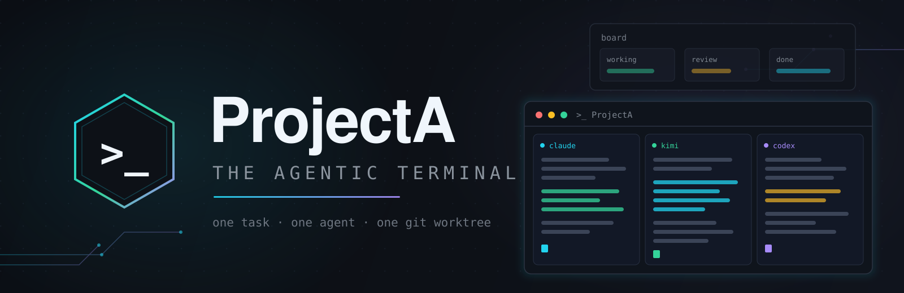
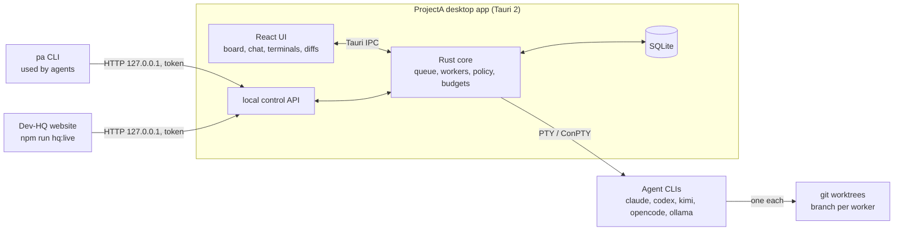

# ProjectA

<div align="center">
  
  <br />
  <p><strong>A Windows desktop app that runs several AI coding agents in parallel, each in its own terminal and its own git worktree.</strong></p>
</div>

---

## At a glance

| | |
| --- | --- |
| **Platform** | Windows (the only packaged and released target). The Rust code also compiles and its tests run on Linux in CI; no Linux or macOS builds are shipped. |
| **Stack** | Tauri 2 · Rust core · SQLite (sqlx) · React 18 + TypeScript · xterm.js |
| **Status** | Personal project, in active development. Latest release: v1.4.1. Work merged to `main` since then is not released yet. Much of the internal documentation is in German. |
| **License** | None yet — all rights reserved (see [License](#license)) |

## What it is

ProjectA is a desktop "agentic terminal". You give it tasks; it starts coding-agent command-line tools (Claude Code, Codex CLI, Kimi CLI, OpenCode, Ollama) in pseudo-terminals, each on its own git branch in its own worktree. From one window you watch them, answer their questions, and review and merge their work.

ProjectA has no model of its own. The agents are the vendors' command-line tools, installed and logged in on your machine. Helper features such as prompt sharpening also run through a headless agent CLI (`oneshot.rs`). Optional profiles route some CLIs through a local OmniRoute router (`resources/agents-omniroute.json`, `omniroute.rs`); this is opt-in.

## Honest status

"Works" means implemented **and** covered by at least one automated test named in parentheses. It does not mean polished or proven in long-running use. "Partial" means implemented and tested, with the restriction stated in the row. "Planned — locked off" means the code exists but cannot be reached in normal use.

| Area | Status | Evidence |
| --- | --- | --- |
| Terminal sessions (ConPTY on Windows) | works | `pty.rs` (`spawns_a_path_resolved_exe_in_a_pty`, Windows-only test) |
| Agent profiles for Claude Code, Codex, Kimi, OpenCode, Ollama | works | `resources/agent-defaults.json`, `profiles.rs` (`claude_and_kimi_defaults_carry_their_capabilities`) |
| One git worktree and branch per worker | works | `worktree.rs` (`adds_and_removes_a_worktree`) |
| Task delivery into an agent's terminal (waits for readiness, checks the echo) | works | `submit_guard.rs` (`a_marker_appearing_late_still_beats_the_silence_heuristic`) |
| Task queue with dispatcher and per-project worker limit | works | `queue.rs` (`priority_wins_and_capacity_never_exceeds_the_limit`) |
| SQLite persistence, backup/restore, session restore after a crash | works | `store.rs`, `db_restore.rs`, `sessionpersist.rs` (`a_crash_restores_buffers_without_a_live_session`) |
| Agents ask the human a question (`pa ask`) and get the answer in their terminal | works | `questions.rs` (`asking_records_the_question_and_raises_the_card`) |
| Diff view and merge with a test gate | works | `diff.rs` (`parses_a_multi_file_diff_with_line_numbers`), `testgate.rs` (`the_verdict_follows_the_exit_code_and_recognises_a_timeout`) |
| Local control API, localhost only, token required | works | `api.rs` (`a_request_without_the_token_is_refused`) |
| `pa` command-line bridge for agents, including `pa hq runtime` / `pa hq context` | partial | `bin/pa.rs` (`hq_parser_preserves_source_goal_and_refuses_unknown_settings` covers the parsing of both commands) and `api.rs` (`hq_changes_require_auth_project_and_valid_cursor` covers the HQ HTTP contract); no test runs `pa` against a live API |
| Skill packs copied into each worktree | works | `skills.rs` (`installing_puts_every_enabled_pack_where_the_cli_looks_for_it`) |
| Token usage, budgets and cost receipts | works | `budget.rs`, `store/development_usage_receipt_tests.rs` (`every_run_cost_receipt_names_its_state_and_provenance`) |
| Learnings and role variants, applied only after human approval | works | `learnings.rs`, `roles.rs` (`two_approved_learnings_are_not_enough_and_three_are`) |
| Provider key vault | partial | Encrypted with DPAPI on Windows (`a_written_vault_is_encrypted_for_this_user_and_round_trips`); on other systems it is a plaintext file with mode 0600 |
| Dev-HQ website (development cockpit) | partial | `scripts/hq-live.mjs` with tests in `scripts/lib/*.test.mjs`; a development tool that runs from the repository, not a product feature |
| Team roles (coordinator, implementer, reviewer, integrator) | planned — **locked off** | `store/team_assignments.rs`, `workers.rs` (`dispatch_role_decides_who_may_submit_an_integration_candidate`); the code exists but is only reachable through continuous mode, which is off |
| Native process-output capture (`projecta_capture`, `pa-capture-host`) | partial | Windows-only; activation in the app is still gated in code |
| Human approval of risky steps | partial | A human verdict token is required to resume (`hq_control_requires_api_auth_and_resume_refuses_without_human_token`); graded approval levels do not exist yet |
| Continuous mode (agents pick up follow-up work on their own) | planned — **locked off** | `development_policy.rs` rejects `continuous.enabled = true` (`default_policy_is_bounded_and_continuous_is_disabled`) |
| Removing a dispatched task from the queue | works | Allowed only after the agent process has provably ended; while it may still run, the request is refused (409) (`api.rs`: `a_dispatched_task_is_cancelled_over_http_only_on_a_proven_process_end`) |

Paths are relative to `src-tauri/src/` unless they start with `scripts/` or `resources/` (the latter is `src-tauri/resources/`).

## Vision

- **One surface.** The desktop app is the core. The Dev-HQ becomes the place where you plan, watch and decide; later it should run from the installed app without Node or a repository checkout (planned, HQ2-08).
- **Agent teams with roles and approval levels.** A task moves through stations such as plan, implement, review and test. Each station has a role, and each risky step has a permission level that the human sets and agents cannot raise themselves (planned, DF-11 to DF-18).
- **Independent review built in.** A change may not be approved by a model from the same family that wrote it (planned as a hard gate, DF-12).
- **Continuous operation only after acceptance.** Continuous mode stays switched off until every row of its acceptance matrix has runtime evidence and the human explicitly turns it on (W4-02, W4-03).

None of this vision is shipped yet beyond what the status table lists.

## How it works



- The **Rust core** owns all runtime state in SQLite. The UI, the `pa` CLI and the Dev-HQ are clients of the same core; none of them schedules work on its own.
- Each **worker** is an agent CLI running in a pseudo-terminal, started in its own git worktree on its own branch. Tasks are typed into that terminal and only count once the echo is seen.
- The **local API** listens on `127.0.0.1` on a random port and rejects requests without a per-process token. Agents use it through `pa`; the Dev-HQ proxies to it.

## How it is built

ProjectA is built by a beginner without programming training, working with several AI coding agents from different vendors (Claude Code, Codex CLI, Kimi CLI, OpenCode). The agents write almost all of the code, tests and documentation. Because the human cannot check the code line by line, the project relies on rules that produce checkable evidence:

- **Red first.** A bug fix needs a failing regression test before the fix. Commits carry a `Test-First`, `Regression-For` or `No-Test` trailer, and CI checks this (`scripts/ci/red-first.sh`).
- **One gate list.** All checks are defined once in `scripts/ci/gates.sh`; git hooks and CI call the same lanes. Every run ends with a "NICHT ABGEDECKT" block (German for "not covered"), because no single machine tests both the Windows and the Linux half.
- **Cross-vendor review.** Changes are reviewed by a model from a different vendor than the author. Larger changes and the four serial "seam" files need two reviews.
- **Merge queue.** `main` is merged only through a Mergify merge queue ([docs/setup/mergify.md](docs/setup/mergify.md)).
- **One task, one agent, one worktree.** The shared rules for all agents are in [AGENTS.md](AGENTS.md).

What is still hard:

- Coordinating several agents takes a lot of process. The rules and plans are long, mostly in German, and have drifted out of sync more than once.
- Some checks are flaky under load. Open cases are listed in [KNOWN_ISSUES.md](KNOWN_ISSUES.md).
- Rules produce evidence, not correctness. Reviews by other models catch a lot, but they are not a human code review.

## Getting started

Windows only; build from source. On a version tag, CI builds signed Windows installers and mirrors them to the public [Cuarroc/ProjectA-updates](https://github.com/Cuarroc/ProjectA-updates) repository, which serves the app's auto-update channel. Installation is not supported for third parties; the intended path from this repository is building from source.

Requirements:

- Node.js 24 or newer
- Rust, stable, 1.89 or newer
- The [Tauri 2 prerequisites for Windows](https://v2.tauri.app/start/prerequisites/) (Microsoft C++ Build Tools, WebView2)
- git
- At least one agent CLI you are logged in to, for example Claude Code or Codex CLI

```sh
npm ci
npm run dev:setup   # installs git hooks into this clone, writes .pa/HQ-START.md
npm run tauri dev   # start the desktop app in development mode
```

- `npm run dev` serves only the UI on `http://localhost:1420`. Without the Tauri runtime, IPC calls do not work.
- `npm run hq:live` starts the Dev-HQ website on `http://localhost:4173`.
- `npm run dev:doctor` diagnoses the setup without changing anything.
- `npm run tauri build` is configured to produce updater artifacts. It expects the project's updater signing key, so outside builders will have to adjust `src-tauri/tauri.conf.json`.
- Checks: `bash scripts/ci/gates.sh --list` shows the gates; `bash scripts/ci/gates.sh lane prepush` runs the full local lane. Details: [docs/ci-lokal.md](docs/ci-lokal.md).

The app starts real agent processes from its queue. Start it only when you mean to, or set `PROJECTA_QUEUE=off` to keep the dispatcher from starting any queued task (`queue.rs`: `queue_dispatch_disabled_recognizes_the_off_switches`).

## Roadmap

The only plan is [docs/PLAN.md](docs/PLAN.md) (German). It is organised in waves and work streams, not in numbered milestones:

1. **W1 – foundations.** Finish task delivery (F-CORE-3 rest), clean up old dispatched queue entries (rest of W1-05b), and finish accessibility and styling work on the Dev-HQ.
2. **W2 and DEVFLOW – runtime and workflow.** Usage and billing collectors per provider, supervisor, and resource limits. Persistent workflow stages, the independence gate, the permission policy, hand-over between stations, and a decision inbox (DF-11 to DF-18).
3. **W3 – delivery and installation.** Database maintenance lock, Windows recovery helper, crash and power-loss drills, and updater states in the app.
4. **W4 – acceptance and switch-on.** A 20-task benchmark, then the final acceptance matrix for continuous mode, then activation. Activation happens only with the human's explicit decision.

In parallel: **HQ2** (one shared Dev-HQ and app, with design tokens and an installable host) and **W5** (a "projects" system with a coordinator that cannot write code and a trust ramp). There are no dates; the plan explicitly avoids promising any before throughput has been measured.

## Known limitations

- **Windows only** for anything beyond compiling and running tests. The DPAPI vault and native capture exist only on Windows.
- **It drives subscription CLIs.** ProjectA starts and types into the command-line tools of AI vendors on your account. Check each vendor's terms of use for automated or parallel use before you run it.
- **Continuous mode is off** and cannot be switched on by configuration.
- **A running agent cannot be interrupted** from the queue. Its dispatched entry can only be removed after the process has provably ended.
- **Documentation gaps in this snapshot.** This public repository is a cleaned copy of a private working repository, published without history. Some documents refer to files that are not included, for example `docs/MASTERPLAN.md`, `docs/ERLEDIGT.md` and `.pa/report_*.md`.
- **Mostly German internal docs.** Plans, rules and the changelog are largely in German.
- **Open findings and flaky tests** are listed, each with a reason, in [KNOWN_ISSUES.md](KNOWN_ISSUES.md).
- **No support.** This is a personal project; issues may go unanswered.

## Documentation

| File | Contents |
| --- | --- |
| [AGENTS.md](AGENTS.md) | Rules for every agent working on the repository |
| [STAND.md](STAND.md) | Current state and next steps (German) |
| [docs/PLAN.md](docs/PLAN.md) | The plan: waves, packages, decisions (German) |
| [KNOWN_ISSUES.md](KNOWN_ISSUES.md) | Open findings, each with its reason (German) |
| [CHANGELOG.md](CHANGELOG.md) | Released changes (German) |
| [docs/setup/](docs/setup/README.md) | Agent setup per vendor, reviewers, merge queue (German) |
| [docs/development/WORKFLOW.md](docs/development/WORKFLOW.md) | Detailed operating reference |
| [docs/decisions.md](docs/decisions.md) | Architecture and dependency decisions |
| [docs/THIRD_PARTY_NOTICES.md](docs/THIRD_PARTY_NOTICES.md) | Third-party software and its licenses |
| [docs/hilfe/glossar.md](docs/hilfe/glossar.md) | Beginner glossary (German) |

## License

There is no license yet, so all rights are reserved. You may read the code, but you may not reuse, modify or redistribute it. Whether and under which license the project will be opened is still to be decided.

## Kurz auf Deutsch

ProjectA ist eine Windows-Desktop-App (Tauri 2, Rust, React), die mehrere KI-Coding-Agenten parallel steuert. Jeder Agent läuft in einem eigenen Terminal und in einem eigenen git-Worktree. Terminals, Worktrees, Warteschlange, lokale API, der `pa`-Befehl und das Zusammenführen mit Testprüfung funktionieren und sind durch Tests belegt. Die Rollen für Agenten-Teams sind im Code vorhanden, aber nur über den Dauerbetrieb (Continuous Mode) erreichbar, und der ist im Code gesperrt, bis seine Abnahme belegt ist und der Nutzer ihn freigibt. Abgestufte Freigaben gibt es noch nicht; sie sind geplant. Gebaut wird das Projekt von einem Einsteiger ohne Programmierausbildung zusammen mit KI-Agenten mehrerer Anbieter, abgesichert durch Red-first-Tests, Reviews durch Modelle anderer Anbieter und eine Merge-Queue. Die App steuert die Abo-CLIs der Anbieter; deren Nutzungsbedingungen sind zu beachten. Eine Lizenz gibt es noch nicht, alle Rechte sind vorbehalten.
