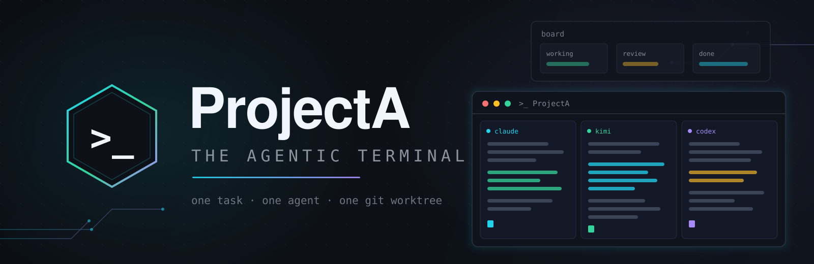

# ProjectA

<div align="center">
  
  <p><em>An agentic terminal for Windows: many AI coding agents, one calm cockpit.</em></p>
  <p><strong>Mehrere KI-Coding-Agenten parallel arbeiten lassen – jeder in seinem eigenen Terminal, Branch und Worktree.</strong></p>
  <p><strong>Fertig ist nur, was bewiesen ist: Grün heißt bewiesen, kein Modell prüft sich selbst, der Mensch behält die Kontrolle.</strong></p>
  <p><strong>Dazu gehören Not-Aus, Kostenkontrolle über Budgetgrenzen und ein nachvollziehbares Protokoll.</strong></p>

  <a href="https://github.com/Cuarroc/ProjectA-updates/releases/latest"></a>
  <a href="LICENSE"></a>
  <a href="https://github.com/Cuarroc/ProjectA/actions/workflows/ci.yml?query=branch%3Amain"></a>
  
</div>

## Inhalt

- [Warum ProjectA?](#warum-projecta)
- [Schnellstart](#schnellstart)
- [Funktionen](#funktionen)
- [Wo steht ProjectA?](#wo-steht-projecta)
- [Status und Grenzen](#status-und-grenzen)
- [Mitmachen als Tester](#mitmachen-als-tester)
- [Dokumentation](#dokumentation)
- [Für Entwickler](#für-entwickler)
- [Lizenz](#lizenz)

## Warum ProjectA?

**Unser Fokus ist sicherer Dauerbetrieb:** Agenten sollen lange für dich
arbeiten können, ohne dass du sie aus den Augen verlieren musst. Dafür gibt es
den Not-Aus (alles sofort stoppen), Budgetgrenzen als Kostenkontrolle und ein
nachvollziehbares Protokoll in der lokalen Datenbank. Der automatische
Dauerbetrieb selbst ist in v1.5.1 noch ausgeschaltet; siehe „Status und Grenzen“.

- **Parallel statt nacheinander:** Jede Aufgabe läuft als eigener Worker mit
  eigenem Git-Branch und Worktree – die Agenten kommen sich nicht in die Quere.
- **Alles auf einem Board:** Terminals, Warteschlange, Diffs und
  Projektstatus in einem Fenster statt verteilt über viele Konsolen.
- **Deine Agenten, deine Zugänge:** ProjectA startet die Agent-CLIs, die du
  schon nutzt (zum Beispiel Claude Code, Codex CLI, Kimi CLI, OpenCode, Ollama).
  Es bringt kein eigenes Modell und keine Anbieterzugänge mit.
- **Du behältst die Kontrolle:** Ein Not-Aus beendet binnen zehn Sekunden alle
  laufenden Agenten; Budgetgrenzen und Rollen begrenzen, was ein Agent darf.
- **Lokal und nachvollziehbar:** Laufzeitdaten liegen in einer lokalen
  SQLite-Datenbank; vor jeder Datenbank-Migration entsteht ein Backup.

## Schnellstart

1. Den Installer `ProjectA_<Version>_x64-setup.exe` von der
   [Release-Seite](https://github.com/Cuarroc/ProjectA-updates/releases/latest)
   laden und ausführen. Spätere Updates kommen über den eingebauten, mit
   Minisign signierten Updater.
2. Mindestens eine Agent-CLI installieren und dort anmelden; die Einrichtung
   je Anbieter steht unter [`docs/setup/`](docs/setup/README.md).
3. In ProjectA links unter „Projekte“ mit „+“ ein Git-Repository hinzufügen.
4. Mit „Neuer Worker“ eine Aufgabe beschreiben und ein Agenten-Profil wählen.
   Den Fortschritt zeigen Board, Terminal und Diff.

## Funktionen

| Funktion | Was sie tut |
| --- | --- |
| Agenten-Terminals | Jeder Worker läuft in einem echten Terminal (PTY) mit eigenem Verlauf. |
| Worktree je Aufgabe | Eigener Branch und Git-Worktree pro Worker. |
| Board und Warteschlange | Aufgaben einreihen; gestartet wird erst, wenn Kapazität frei ist. |
| Diff und Review | Änderungen eines Workers ansehen und zeilenweise kommentieren. |
| Orchestrator-Chat | Wünsche in Worte fassen; der Orchestrator verteilt die Arbeit. |
| Not-Aus | Stoppt alle Agenten binnen 10 s und blockiert neue Aufträge, auch über Neustarts. |
| Budget und Rollen | Schwellen auf die Nutzungsfenster der Anbieter; Rechte je Rolle. |
| Learnings | Was Agenten im Projekt gelernt haben; ein Mensch gibt es frei. |
| Web-Interface | Board und Learnings nur lesend im Browser, etwa auf dem Handy. |
| Sitzungen wiederherstellen | Verlauf und Entwürfe überstehen einen Neustart (höchstens 7 Tage). |
| Kommandozeile `pa` | Spricht mit der laufenden App über eine lokale, per Token geschützte API. |

## Wo steht ProjectA?

- **Aktuelle Version: `v1.5.1`.** Was sich ändert, steht im
  [`CHANGELOG.md`](CHANGELOG.md).
- **Der Plan für Version 2.0 ist am 06.10.2026 freigegeben.** Die verständliche
  Kurzfassung steht in [`docs/roadmap-2.0.md`](docs/roadmap-2.0.md), der
  vollständige Plan in [`docs/plan/v2.0/plan.md`](docs/plan/v2.0/plan.md).
- Der automatische Dauerbetrieb bleibt bis auf Weiteres ausgeschaltet; er wird
  erst nach belegter Abnahme und nur durch den Menschen freigegeben.

## Status und Grenzen

- **App-Version:** `v1.5.1` – diese Version baut der Quellcode auf `main`.
- **Veröffentlicht:** zuletzt `v1.5.1`.
  Was sich ändert, steht im [`CHANGELOG.md`](CHANGELOG.md).
- Aktives persönliches Projekt. Windows ist das einzige paketierte Ziel.
  Plattformneutrale und Linux-spezifische Prüfungen laufen zusätzlich unter
  Linux beziehungsweise WSL2; ein Linux- oder macOS-Paket gibt es nicht.
- Der Dauerbetrieb (Continuous) ist in v1.5.1 ausgeschaltet und nicht
  freigegeben.
- Agent-CLIs und Anbieterzugänge bringst du selbst mit (siehe oben).
- Interne Projektunterlagen sind überwiegend auf Deutsch.

## Mitmachen als Tester

Du möchtest ProjectA ausprobieren? Installiere die aktuelle Version von der
[Release-Seite](https://github.com/Cuarroc/ProjectA-updates/releases/latest)
und arbeite die kurze Klickliste in [`docs/TESTEN.md`](docs/TESTEN.md) durch.
Deine Beobachtungen meldest du am besten über die Issue-Vorlage
„Tester-Feedback“ – sie fragt genau das ab, was wir zur Fehlersuche brauchen.

## Dokumentation

- [`docs/setup/`](docs/setup/README.md) – Agent-CLIs und Anbieter einrichten
- [`docs/drills/`](docs/drills/README.md) – Prüfabläufe für die installierte App
- [`CHANGELOG.md`](CHANGELOG.md) – Änderungen je Version
- [`KNOWN_ISSUES.md`](KNOWN_ISSUES.md) – bekannte offene Befunde
- [`SECURITY.md`](SECURITY.md) – Sicherheitslücken vertraulich melden

## Für Entwickler

ProjectA ist mit [Tauri 2](https://v2.tauri.app/) gebaut. Der Rust-Kern
verwaltet Laufzeitdaten in SQLite, die Oberfläche verwendet React und
TypeScript. Die folgenden Abschnitte richten sich an Mitwirkende.

### Voraussetzungen

- Node.js 24 oder neuer
- Rust 1.89 oder neuer (stable) und Cargo
- Git; für den vollständigen PR-Ablauf außerdem die GitHub CLI `gh`
- die [Tauri-2-Voraussetzungen für Windows](https://v2.tauri.app/start/prerequisites/)
- mindestens eine lokal eingerichtete Agent-CLI, wenn echte Worker gestartet
  werden sollen

Die anbieterspezifische Einrichtung steht unter
[`docs/setup/`](docs/setup/README.md).

### Lokal einrichten und prüfen

```sh
npm ci
npm run dev:doctor                 # nur Diagnose, verändert nichts
npm run dev:agent-check            # prüft die Agent-Entwicklungsumgebung
bash scripts/ci/doctor.sh           # zeigt, was diese Maschine belegen kann
bash scripts/ci/gates.sh --list     # aktuelle Gate-Liste
bash scripts/ci/gates.sh lane prepush
```

`prepush` ist die vollständige lokale Prüfbahn. Sie umfasst unter anderem
TypeScript-, Frontend-, HQ- und Rust-Prüfungen; die verbindliche Liste lebt nur
in `scripts/ci/gates.sh`. Kein einzelner Rechner deckt sowohl die
Windows- als auch die Linux-spezifischen Tests ab. Jeder Gate-Lauf nennt das
im Block `NICHT ABGEDECKT`; Details stehen in
[`docs/ci-lokal.md`](docs/ci-lokal.md).

`npm run dev:setup` richtet die Clone-lokalen Git-Hooks ein und erzeugt
`.pa/HQ-START.md`. Das ist eine bewusste schreibende Einrichtung und daher
nicht Teil der reinen Diagnose oben.

Die Desktop-App wird mit `npm run tauri dev` gestartet. Dabei können vorhandene
Queue-Einträge echte Agenten starten. Starte sie deshalb nur bewusst; für eine
Entwicklungssitzung ohne Dispatcher kann `PROJECTA_QUEUE=off` gesetzt werden.

### Sicher beitragen

1. Vor Beginn `STAND.md` und `docs/PLAN.md` lesen und den Live-Stand von
   `origin/main` und den offenen Pull Requests prüfen.
2. Pro Paket einen eigenen Branch und Worktree verwenden; fremde Änderungen
   nicht übernehmen oder verwerfen.
3. Für Fehler zuerst einen kompilierenden, fehlschlagenden Regressionstest
   hinzufügen. Reine Dokumentationsänderungen sind davon ausgenommen.
4. Vor jedem Commit den Secret-Scan und vor dem Push die vollständige
   `prepush`-Bahn im eigenen Worktree erfolgreich ausführen. Hooks nie umgehen.
5. Den Branch pushen, den Push gegen den Remote-Stand prüfen und einen
   Draft-PR mit Befehlen, Exit-Codes, Review-Ergebnissen und
   `NICHT ABGEDECKT`-Block eröffnen.
6. `main` nur über die Mergify-Queue zusammenführen; nicht rebasen oder
   force-pushen.

Die vollständigen, verbindlichen Regeln stehen in [`AGENTS.md`](AGENTS.md).

### Orientierung

| Datei | Zweck |
| --- | --- |
| [`AGENTS.md`](AGENTS.md) | Verbindliche Arbeits-, Prüf- und PR-Regeln |
| [`STAND.md`](STAND.md) | Kurzer aktueller Projektstand |
| [`docs/PLAN.md`](docs/PLAN.md) | Einziger Plan: M1–M4, geparkte Arbeit und Entscheidungen |
| [`KNOWN_ISSUES.md`](KNOWN_ISSUES.md) | Bekannte offene Befunde |
| [`docs/setup/README.md`](docs/setup/README.md) | Einrichtung der Agent-Werkzeuge |
| [`docs/ci-lokal.md`](docs/ci-lokal.md) | Lokale Gates und Plattformgrenzen |
| [`SECURITY.md`](SECURITY.md) | Vertrauliches Melden von Sicherheitslücken |

## Lizenz

ProjectA steht unter der [MIT-Lizenz](LICENSE). Hinweise zu eingebundener
Drittsoftware stehen in
[`docs/THIRD_PARTY_NOTICES.md`](docs/THIRD_PARTY_NOTICES.md).
